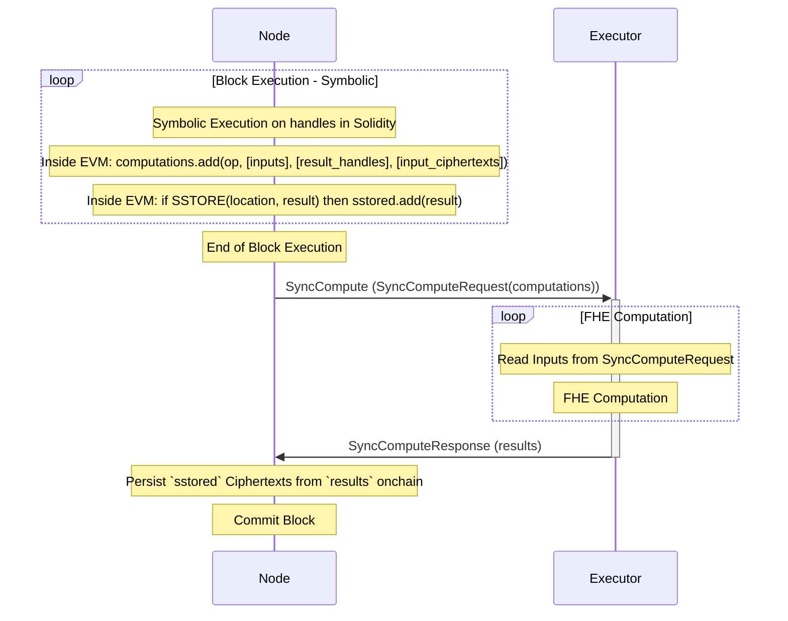

# Execution

Block execution in fhEVM-native is split into two parts:
 * symbolic execution
 * FHE computation

```mermaid
sequenceDiagram
    participant Node
    participant Executor

    loop Block Execution - Symbolic
        Note over Node: Symbolic Execution on handles in Solidity
        Note over Node: Inside EVM: computations.add(op, [inputs], [result_handles], [input_ciphertexts])
        Note over Node: Inside EVM: if SSTORE(location, result) then sstored.add(result)
    end

    Note over Node: End of Block Execution
    Node->>+Executor: SyncCompute (SyncComputeRequest(computations))
       loop FHE Computation
        Note over Executor: Read Inputs from SyncComputeRequest
        Note over Executor: FHE Computation
    end
    Executor->>-Node: SyncComputeResponse (results)

    Note over Node: Persist `sstored` Ciphertexts from `results` onchain
    Note over Node: Commit Block
```
